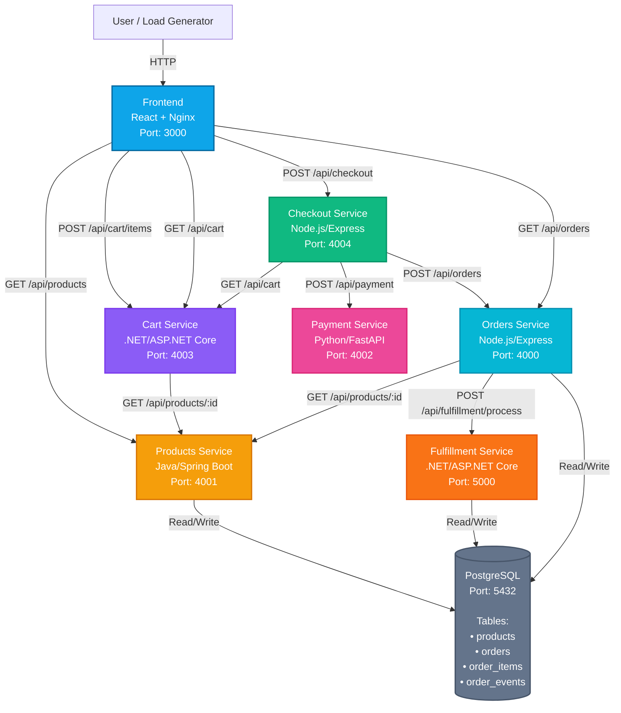

# Cosmic Coffee Demo Application

A lightweight, full-stack demo application designed to showcase Observability tools. This application demonstrates a complete polyglot microservices architecture with services written in Node.js, Java, Python, and .NET, optimized for distributed tracing use cases.

## Architecture

The application consists of multiple microservices in a polyglot architecture:

1. **Frontend** - React-based web application with JavaScript instrumentation hooks
2. **Products Service** - Java/Spring Boot service for product catalog management
3. **Cart Service** - .NET/ASP.NET Core service for shopping cart management
4. **Payment Service** - Python/FastAPI service for payment processing (simulated)
5. **Checkout Service** - Node.js/Express service that orchestrates checkout flow
6. **Orders Service** - Node.js/Express service for order management and queries
7. **Fulfillment Service** - .NET/ASP.NET Core service for order fulfillment processing
8. **Database** - PostgreSQL database for persistent storage

### Architecture Diagram



### Service Communication Flow

1. **User adds items to cart** via Frontend
2. **Frontend** → **Cart Service** (POST `/api/cart/items`)
3. **Cart Service** → **Products Service** (validate products exist)
4. **User initiates checkout** via Frontend
5. **Frontend** → **Checkout Service** (POST `/api/checkout`)
6. **Checkout Service** → **Cart Service** (GET `/api/cart` - retrieve cart contents)
7. **Checkout Service** → **Payment Service** (POST `/api/payment` - process payment)
8. **Checkout Service** → **Orders Service** (POST `/api/orders` - create order)
9. **Checkout Service** → **Cart Service** (DELETE `/api/cart` - clear cart)
10. **Orders Service** → **Products Service** (GET `/api/products/{id}` - enrich with product names)
11. **Orders Service** → **Fulfillment Service** (POST `/api/fulfillment/process` - notify order for processing)
12. **Fulfillment Service** processes order asynchronously (status: `pending` → `processing` → `completed`)
13. Services read/write to **PostgreSQL** database as needed

## Features

- **Order Management**: Customers can browse products, add items to cart, and place orders
- **Real-time Processing**: Orders are processed asynchronously through the fulfillment service
- **Status Tracking**: Order status updates (pending → processing → completed)
- **Event Logging**: Order events are logged for observability
- **RESTful API**: Complete REST API for products and orders
- **Performance Simulation**: Payment service includes configurable slowdown simulation for observability demos
- **Observability Ready**: Instrumentation hooks ready for APM agents

## Prerequisites

- Docker and Docker Compose installed
- Node.js 24+ (for local development of Node.js services)
- .NET 8 SDK (for local development of .NET services)
- Java 21+ and Maven (for local development of Java service)
- Python 3.11+ (for local development of Python service)
- PostgreSQL client (optional, for direct database access)

## Quick Start with Docker

1. Clone this repository:
```bash
git clone <repository-url>
cd cosmic-coffee-demo
```

2. Start all services:
```bash
docker-compose -f infrastructure/docker/docker-compose.yml up --build
```

Or use the helper script:
```bash
scripts/start.sh
```

3. Access the application:
   - Frontend: http://localhost:3000
   - Products API: http://localhost:4001
   - Payment API: http://localhost:4002
   - Cart API: http://localhost:4003
   - Checkout API: http://localhost:4004
   - Orders API: http://localhost:4000
   - Fulfillment API: http://localhost:5000
   - PostgreSQL: localhost:5432

4. Stop all services:
```bash
docker-compose -f infrastructure/docker/docker-compose.yml down
```

Or use the helper script:
```bash
scripts/stop.sh
```

## Local Development

### Products Service (Java/Spring Boot)

```bash
cd services/products
mvn spring-boot:run
```

Or build with Maven:
```bash
mvn clean package
java -jar target/products-service-1.0.0.jar
```

Set environment variables:
```
DB_HOST=localhost
DB_PORT=5432
DB_NAME=cosmic_coffee
DB_USER=postgres
DB_PASSWORD=postgres
NEW_RELIC_LICENSE_KEY=your_license_key
```

### Checkout Service (Node.js/Express)

```bash
cd services/checkout
npm install
node server.js
```

Set environment variables:
```
CART_SERVICE_URL=http://localhost:4003
PAYMENT_SERVICE_URL=http://localhost:4002
ORDERS_SERVICE_URL=http://localhost:4000
PORT=4004
NEW_RELIC_LICENSE_KEY=your_license_key
```

### Payment Service (Python/FastAPI)

```bash
cd services/payment
pip install -r requirements.txt
uvicorn main:app --reload --port 4002
```

Set environment variables:
```
PAYMENT_SLOWDOWN_ENABLED=false  # Set to true to enable slowdown simulation
```

### Cart Service (.NET/ASP.NET Core)

```bash
cd services/cart
dotnet run
```

Set environment variables:
```
ProductsServiceUrl=http://localhost:4001
ASPNETCORE_URLS=http://0.0.0.0:4003
```

### Orders Service (Node.js)

```bash
cd services/orders
npm install
npm run dev  # Uses nodemon for auto-reload
```

Set environment variables (create `.env` file):
```
DB_HOST=localhost
DB_PORT=5432
DB_NAME=cosmic_coffee
DB_USER=postgres
DB_PASSWORD=postgres
PRODUCTS_SERVICE_URL=http://localhost:4001
FULFILLMENT_SERVICE_URL=http://localhost:5000
```

### Fulfillment Service (.NET/ASP.NET Core)

```bash
cd services/fulfillment
dotnet run
```

Set environment variables:
```
DB_HOST=localhost
DB_PORT=5432
DB_NAME=cosmic_coffee
DB_USER=postgres
DB_PASSWORD=postgres
```

### Frontend

```bash
cd services/frontend
npm install
npm start  # Runs on http://localhost:3000
```

## API Endpoints

### Products
- `GET /api/products` - Get all products
- `GET /api/products/:id` - Get product by ID

### Cart
- `GET /api/cart` - Get current cart
- `POST /api/cart/items` - Add item to cart
- `PATCH /api/cart/items/{productId}` - Update item quantity
- `DELETE /api/cart/items/{productId}` - Remove item from cart
- `DELETE /api/cart` - Clear cart

### Payment
- `POST /api/payment` - Process payment (simulated)

**Configuration:**
- `PAYMENT_SLOWDOWN_ENABLED` - Enable periodic slowdown simulation (default: `false`)
  - When enabled, adds random 2-5 second delays every 15 minutes for 5 minutes
  - Useful for demonstrating performance issues in observability tools

### Checkout
- `POST /api/checkout` - Complete checkout (cart → payment → order)

### Orders
- `GET /api/orders` - Get all orders
- `GET /api/orders/:id` - Get order by ID
- `POST /api/orders` - Create a new order
- `PATCH /api/orders/:id/status` - Update order status
- `GET /api/orders/:id/events` - Get order events

### Fulfillment
- `POST /api/fulfillment/process` - Process order for fulfillment

### Health & Metrics
- `GET /health` - Health check endpoint (all services)
- `GET /api/metrics` - Application metrics (Orders service)

## Instrumentation

### Frontend JavaScript Instrumentation

The frontend includes hooks for JavaScript APM agents. To instrument with your observability tool:

1. **New Relic**: Add the New Relic loader script to `frontend/public/index.html`:
```html
<script src="https://js.newrelic.com/nr-loader-min.js" data-account-id="YOUR_ACCOUNT_ID"></script>
```

2. **Custom Events**: The code includes example instrumentation hooks (commented out) in:
   - `frontend/src/App.js` - User interactions and API calls
   - `frontend/src/index.js` - Application initialization

### Payment Service Configuration

The Payment service includes a configurable slowdown simulation feature for observability demonstrations:

**Environment Variables:**
- `PAYMENT_SLOWDOWN_ENABLED` - Enable/disable periodic slowdown simulation
  - Set to `true`, `1`, or `yes` to enable (case-insensitive)
  - Default: `false` (disabled)
  - When enabled:
    - Triggers every 15 minutes
    - Lasts for 5 minutes each time
    - Adds random delays of 2-5 seconds to payment processing during slowdown periods
    - Logs slowdown events for observability

**Example usage:**
```bash
# Docker Compose
PAYMENT_SLOWDOWN_ENABLED=true docker-compose up

# Kubernetes - Update ConfigMap or deployment
kubectl set env deployment/payment PAYMENT_SLOWDOWN_ENABLED=true -n cosmic-coffee
```

### Service Instrumentation

Each service can be instrumented with your chosen APM agent. The application includes instrumentation hooks and structured logging for observability tools like New Relic, Datadog, or others.

## Database Schema

The database includes the following tables:

- **products** - Product catalog
- **orders** - Customer orders
- **order_items** - Items in each order
- **order_events** - Event log for order processing

See `database/init.sql` for the complete schema.

## Kubernetes Deployment

For Kubernetes deployment, you can create manifests for each service. Example structure:

```
infrastructure/k8s/
  ├── frontend-deployment.yaml
  ├── products-deployment.yaml
  ├── cart-deployment.yaml
  ├── payment-deployment.yaml
  ├── checkout-deployment.yaml
  ├── orders-deployment.yaml
  ├── fulfillment-deployment.yaml
  ├── postgres-deployment.yaml
  └── ...
```

Each service can be deployed independently and instrumented with your observability tool's Kubernetes integration.

## Observability Scenarios

This application is designed to demonstrate:

1. **End User Monitoring (EUM)**: Frontend JavaScript performance and user interactions
2. **Application Performance Monitoring (APM)**: Backend API performance and database queries
3. **Distributed Tracing**: Track requests across frontend → microservices → database
4. **Log Management**: Application logs from all services
5. **Custom Metrics**: Order processing times, order counts, revenue metrics
6. **Error Tracking**: Error handling and exception tracking
7. **Service Dependencies**: Map dependencies between services

## Troubleshooting

### Database Connection Issues
- Ensure PostgreSQL container is running: `docker ps`
- Check database credentials in `docker-compose.yml`
- Verify network connectivity: `docker network ls`

### Frontend Not Loading
- Ensure backend is running (required for API calls)
- Check browser console for errors
- Verify API URL in `frontend/src/App.js`

### Orders Not Processing
- Check fulfillment service logs: `docker-compose logs fulfillment`
- Check orders service logs: `docker-compose logs orders`
- Check database for order_events table entries

### Payment Service Slowdown

To enable the payment slowdown simulation feature:

**Docker Compose:**
```bash
PAYMENT_SLOWDOWN_ENABLED=true docker-compose up
```

**Kubernetes:**
```bash
kubectl set env deployment/payment PAYMENT_SLOWDOWN_ENABLED=true -n cosmic-coffee
kubectl rollout restart deployment/payment -n cosmic-coffee
```

The slowdown will start automatically after 15 minutes and repeat every 15 minutes, with each slowdown period lasting 5 minutes.

## License

MIT License - See LICENSE file for details

## Contributing

This is a demo application. Feel free to fork and customize for your observability demonstrations.
