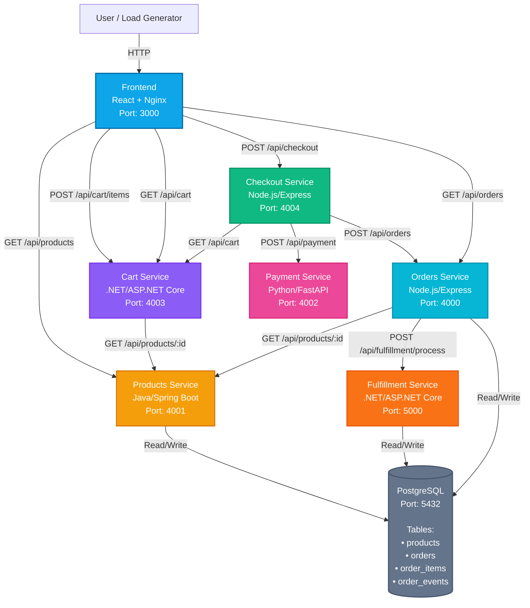

# Cosmic Coffee Demo Application

A lightweight, full-stack demo application designed to showcase Observability tools. This application demonstrates a complete polyglot microservices architecture with services written in Node.js, Java, Python, and .NET, optimized for distributed tracing use cases.

## Table of Contents

- [Architecture](#architecture)
  - [Architecture Diagram](#architecture-diagram)
  - [Service Communication Flow](#service-communication-flow)
- [Features](#features)
- [Prerequisites](#prerequisites)
- [Service Ports Reference](#service-ports-reference)
- [Quick Start](#quick-start)
  - [Docker Compose](#docker-compose)
  - [Kubernetes](#kubernetes)
- [Local Development](#local-development)
  - [Products Service (Java/Spring Boot)](#products-service-javaspring-boot)
  - [Checkout Service (Node.js/Express)](#checkout-service-nodejsexpress)
  - [Payment Service (Python/FastAPI)](#payment-service-pythonfastapi)
  - [Cart Service (.NET/ASP.NET Core)](#cart-service-netaspnet-core)
  - [Orders Service (Node.js)](#orders-service-nodejs)
  - [Fulfillment Service (.NET/ASP.NET Core)](#fulfillment-service-netaspnet-core)
  - [Frontend](#frontend)
- [API Endpoints](#api-endpoints)
  - [Products](#products)
  - [Cart](#cart)
  - [Payment](#payment)
  - [Checkout](#checkout)
  - [Orders](#orders)
  - [Fulfillment](#fulfillment)
  - [Health & Metrics](#health--metrics)
- [Instrumentation](#instrumentation)
  - [Service Instrumentation](#service-instrumentation)
- [Database Schema](#database-schema)
- [Kubernetes Deployment](#kubernetes-deployment)
- [Observability Scenarios](#observability-scenarios)
  - [Feature Flags for Observability Demos](#feature-flags-for-observability-demos)
    - [Payment Service Slowdown](#payment-service-slowdown)
    - [Orders Service N+1 Query Pattern](#orders-service-n1-query-pattern)
    - [Network Fault Injection (Checkout Service)](#network-fault-injection-checkout-service)
    - [Random Order Errors](#random-order-errors)
- [Troubleshooting](#troubleshooting)
  - [Database Connection Issues](#database-connection-issues)
  - [Frontend Not Loading](#frontend-not-loading)
  - [Orders Not Processing](#orders-not-processing)
- [License](#license)
- [Contributing](#contributing)

## Architecture

The application consists of multiple microservices in a polyglot architecture:

1. **Frontend** - React-based web application with JavaScript instrumentation hooks
2. **Products Service** - Java/Spring Boot service for product catalog management
3. **Cart Service** - .NET/ASP.NET Core service for shopping cart management
4. **Payment Service** - Python/FastAPI service for payment processing (simulated)
5. **Checkout Service** - Node.js/Express service that orchestrates checkout flow
6. **Orders Service** - Node.js/Express service for order management and queries
7. **Fulfillment Service** - .NET/ASP.NET Core service for order fulfillment processing
8. **Database** - PostgreSQL database for persistent storage

### Architecture Diagram


```mermaid
graph TB
    User[User / Load Generator]
    Frontend[Frontend<br/>React + Nginx<br/>Port: 3000]
    
    Products[Products Service<br/>Java/Spring Boot<br/>Port: 4001]
    Cart[Cart Service<br/>.NET/ASP.NET Core<br/>Port: 4003]
    Payment[Payment Service<br/>Python/FastAPI<br/>Port: 4002]
    Checkout[Checkout Service<br/>Node.js/Express<br/>Port: 4004]
    Orders[Orders Service<br/>Node.js/Express<br/>Port: 4000]
    Fulfillment[Fulfillment Service<br/>.NET/ASP.NET Core<br/>Port: 5000]
    
    DB[(PostgreSQL<br/>Port: 5432<br/><br/>Tables:<br/>• products<br/>• orders<br/>• order_items<br/>• order_events)]
    
    User -->|HTTP| Frontend
    Frontend -->|GET /api/products| Products
    Frontend -->|POST /api/cart/items| Cart
    Frontend -->|GET /api/cart| Cart
    Frontend -->|POST /api/checkout| Checkout
    Frontend -->|GET /api/orders| Orders
    
    Cart -->|"GET /api/products/:id"| Products
    
    Checkout -->|GET /api/cart| Cart
    Checkout -->|POST /api/payment| Payment
    Checkout -->|POST /api/orders| Orders
    
    Orders -->|"GET /api/products/:id"| Products
    Orders -->|POST /api/fulfillment/process| Fulfillment
    
    Products -->|Read/Write| DB
    Orders -->|Read/Write| DB
    Fulfillment -->|Read/Write| DB
    
    style Frontend fill:#0ea5e9,stroke:#0369a1,stroke-width:2px,color:#ffffff
    style Products fill:#f59e0b,stroke:#d97706,stroke-width:2px,color:#ffffff
    style Cart fill:#8b5cf6,stroke:#7c3aed,stroke-width:2px,color:#ffffff
    style Payment fill:#ec4899,stroke:#db2777,stroke-width:2px,color:#ffffff
    style Checkout fill:#10b981,stroke:#059669,stroke-width:2px,color:#ffffff
    style Orders fill:#06b6d4,stroke:#0891b2,stroke-width:2px,color:#ffffff
    style Fulfillment fill:#f97316,stroke:#ea580c,stroke-width:2px,color:#ffffff
    style DB fill:#64748b,stroke:#475569,stroke-width:2px,color:#ffffff
```

### Service Communication Flow

1. **User adds items to cart** via Frontend
2. **Frontend** → **Cart Service** (POST `/api/cart/items`)
3. **Cart Service** → **Products Service** (validate products exist)
4. **User initiates checkout** via Frontend
5. **Frontend** → **Checkout Service** (POST `/api/checkout`)
6. **Checkout Service** → **Cart Service** (GET `/api/cart` - retrieve cart contents)
7. **Checkout Service** → **Payment Service** (POST `/api/payment` - process payment)
8. **Checkout Service** → **Orders Service** (POST `/api/orders` - create order)
9. **Checkout Service** → **Cart Service** (DELETE `/api/cart` - clear cart)
10. **Orders Service** → **Products Service** (GET `/api/products/{id}` - enrich with product names)
11. **Orders Service** → **Fulfillment Service** (POST `/api/fulfillment/process` - notify order for processing)
12. **Fulfillment Service** processes order asynchronously (status: `pending` → `processing` → `completed`)
13. Services read/write to **PostgreSQL** database as needed

## Features

- **Order Management**: Customers can browse products, add items to cart, and place orders
- **Real-time Processing**: Orders are processed asynchronously through the fulfillment service
- **Status Tracking**: Order status updates (pending → processing → completed)
- **Event Logging**: Order events are logged for observability
- **RESTful API**: Complete REST API for products and orders
- **Performance Simulation**: Payment service includes configurable slowdown simulation for observability demos
- **Observability Ready**: Instrumentation hooks ready for APM agents

## Prerequisites

- Docker and Docker Compose installed
- Node.js 24+ (for local development of Node.js services)
- .NET 8 SDK (for local development of .NET services)
- Java 21+ and Maven (for local development of Java service)
- Python 3.11+ (for local development of Python service)
- PostgreSQL client (optional, for direct database access)

## Service Ports Reference

All services run on localhost with the following ports:

| Service | Port | Environment |
|---------|------|-------------|
| Frontend | 3000 | Docker / K8s |
| Products API | 4001 | Docker / K8s |
| Payment API | 4002 | Docker / K8s |
| Cart API | 4003 | Docker / K8s |
| Checkout API | 4004 | Docker / K8s |
| Orders API | 4000 | Docker / K8s |
| Fulfillment API | 5000 | Docker / K8s |
| PostgreSQL | 5432 | Docker only |

## Quick Start

### Common Setup

Clone the repository:
```bash
git clone <repository-url>
cd cosmic-coffee-demo
```

### Docker Compose

**Start all services:**
```bash
docker-compose -f infrastructure/docker/docker-compose.yml up --build
```

Or use the helper script:
```bash
scripts/start.sh
```

**Access the application:**
- Frontend: http://localhost:3000
- Other services: Use ports from table above

**Stop all services:**
```bash
docker-compose -f infrastructure/docker/docker-compose.yml down
```

Or use the helper script:
```bash
scripts/stop.sh
```

### Kubernetes

**Prerequisites:**
- Kubernetes cluster (local with minikube/kind, or cloud-based)
- kubectl configured to access your cluster
- **Required:** Docker images built and available (see [infrastructure/k8s/README.md](infrastructure/k8s/README.md) for detailed build instructions)

**Deploy all services:**
```bash
cd infrastructure/k8s
kubectl apply -k .
```

**Wait for pods to be ready:**
```bash
kubectl wait --for=condition=ready pod -l app=frontend -n cosmic-coffee --timeout=300s
kubectl wait --for=condition=ready pod -l app=postgres -n cosmic-coffee --timeout=120s
```

**Access the application:**

Port-forward to the frontend service:
```bash
kubectl port-forward service/frontend 3000:80 -n cosmic-coffee
```

Then access at: http://localhost:3000

Or port-forward to individual services (use ports from table above):
```bash
kubectl port-forward service/products 4001:4001 -n cosmic-coffee
kubectl port-forward service/payment 4002:4002 -n cosmic-coffee
kubectl port-forward service/cart 4003:4003 -n cosmic-coffee
kubectl port-forward service/checkout 4004:4004 -n cosmic-coffee
kubectl port-forward service/orders 4000:4000 -n cosmic-coffee
kubectl port-forward service/fulfillment 5000:5000 -n cosmic-coffee
```

**Check service status:**
```bash
kubectl get pods -n cosmic-coffee
kubectl get services -n cosmic-coffee
```

**View logs:**
```bash
kubectl logs -f deployment/frontend -n cosmic-coffee
```

**Cleanup:**
```bash
cd infrastructure/k8s
kubectl delete -k .
```

For detailed Kubernetes deployment instructions, build options, and troubleshooting, see [infrastructure/k8s/README.md](infrastructure/k8s/README.md).

## Local Development

### Common Environment Variables

Most services share the same database configuration. Create a `.env` file or export these variables:

```bash
DB_HOST=localhost
DB_PORT=5432
DB_NAME=cosmic_coffee
DB_USER=postgres
DB_PASSWORD=postgres
```

### Products Service (Java/Spring Boot)

```bash
cd services/products
mvn spring-boot:run
```

Or build with Maven:
```bash
mvn clean package
java -jar target/products-service-1.0.0.jar
```

**Environment Variables:**
- Common database variables (see above)
- `NEW_RELIC_LICENSE_KEY=your_license_key`

### Checkout Service (Node.js/Express)

```bash
cd services/checkout
npm install
node server.js
```

**Environment Variables:**
```
CART_SERVICE_URL=http://localhost:4003
PAYMENT_SERVICE_URL=http://localhost:4002
ORDERS_SERVICE_URL=http://localhost:4000
PORT=4004
NEW_RELIC_LICENSE_KEY=your_license_key
```

### Payment Service (Python/FastAPI)

```bash
cd services/payment
pip install -r requirements.txt
uvicorn main:app --reload --port 4002
```

**Note:** Payment service is stateless and does not use the database.

### Cart Service (.NET/ASP.NET Core)

```bash
cd services/cart
dotnet run
```

**Environment Variables:**
```
ProductsServiceUrl=http://localhost:4001
ASPNETCORE_URLS=http://0.0.0.0:4003
```

**Note:** Uses PascalCase for configuration keys per .NET conventions.

### Orders Service (Node.js)

```bash
cd services/orders
npm install
npm run dev  # Uses nodemon for auto-reload
```

**Environment Variables:**
- Common database variables (see above)
- `PRODUCTS_SERVICE_URL=http://localhost:4001`
- `FULFILLMENT_SERVICE_URL=http://localhost:5000`

For feature flag demos, see [Observability Scenarios](#observability-scenarios).

### Fulfillment Service (.NET/ASP.NET Core)

```bash
cd services/fulfillment
dotnet run
```

**Environment Variables:**
- Common database variables (see above)

### Frontend

```bash
cd services/frontend
npm install
npm start  # Runs on http://localhost:3000
```

## API Endpoints

### Products
- `GET /api/products` - Get all products
- `GET /api/products/:id` - Get product by ID

### Cart
- `GET /api/cart` - Get current cart
- `POST /api/cart/items` - Add item to cart
- `PATCH /api/cart/items/{productId}` - Update item quantity
- `DELETE /api/cart/items/{productId}` - Remove item from cart
- `DELETE /api/cart` - Clear cart

### Payment
- `POST /api/payment` - Process payment (simulated)

### Checkout
- `POST /api/checkout` - Complete checkout (cart → payment → order)

### Orders
- `GET /api/orders` - Get all orders
- `GET /api/orders/:id` - Get order by ID
- `GET /api/orders/search?query=<value>` - Search orders by ID (numeric) or customer name (text, case-insensitive partial match)
- `POST /api/orders` - Create a new order
- `PATCH /api/orders/:id/status` - Update order status
- `GET /api/orders/:id/events` - Get order events

### Fulfillment
- `POST /api/fulfillment/process` - Process order for fulfillment

### Health & Metrics
- `GET /health` - Health check endpoint (all services)
- `GET /api/metrics` - Application metrics (Orders service)

## Instrumentation

### Service Instrumentation

Each service can be instrumented with your chosen APM agent. The application includes instrumentation hooks and structured logging for observability tools like New Relic.

## Database Schema

The database includes the following tables:

- **products** - Product catalog
- **orders** - Customer orders
- **order_items** - Items in each order
- **order_events** - Event log for order processing

See `database/init.sql` for the complete schema.

## Kubernetes Deployment

For Kubernetes deployment, you can create manifests for each service. Example structure:

```
infrastructure/k8s/
  ├── frontend-deployment.yaml
  ├── products-deployment.yaml
  ├── cart-deployment.yaml
  ├── payment-deployment.yaml
  ├── checkout-deployment.yaml
  ├── orders-deployment.yaml
  ├── fulfillment-deployment.yaml
  ├── postgres-deployment.yaml
  └── ...
```

Each service can be deployed independently and instrumented with your observability tool's Kubernetes integration.

## Observability Scenarios

This application is designed to demonstrate:

1. **End User Monitoring (EUM)**: Frontend JavaScript performance and user interactions
2. **Application Performance Monitoring (APM)**: Backend API performance and database queries
3. **Distributed Tracing**: Track requests across frontend → microservices → database
4. **Log Management**: Application logs from all services
5. **Custom Metrics**: Order processing times, order counts, revenue metrics
6. **Error Tracking**: Error handling and exception tracking
7. **Service Dependencies**: Map dependencies between services
8. **Container/Kubernetes Infrastructure**: Container metrics, pod health, resource utilization, and Kubernetes cluster observability

### Feature Flags for Observability Demos

The application includes configurable feature flags to simulate various failure scenarios and performance issues for observability demonstrations:

#### Payment Service Slowdown

**Service:** Payment Service  
Simulate consistent performance degradation to test observability alerting and anomaly detection.

**Environment Variable:**
- `PAYMENT_SLOWDOWN_ENABLED` - Enable/disable slowdown (default: `false`)
  - Set to `true`, `1`, or `yes` to enable (case-insensitive)
  - When enabled: All payment requests have a random 2-5 second delay added
  - When disabled: Normal payment processing (no additional delay)
  - Binary control: Always on when enabled, use kubectl patch or cronjobs to toggle

**Expected Observability Signals:**
- Payment API response time increases to 2-5 second range (when enabled)
- Apdex score drops
- Throughput may decrease
- "slowdown_delay_applied" events appear in logs
- Checkout service timeout errors (503) if combined with network chaos

**Usage:**

```bash
# Docker Compose - Enable slowdown
PAYMENT_SLOWDOWN_ENABLED=true docker-compose up

# Kubernetes - Enable slowdown
kubectl set env deployment/payment PAYMENT_SLOWDOWN_ENABLED=true -n cosmic-coffee
kubectl rollout restart deployment/payment -n cosmic-coffee

# Kubernetes - Disable slowdown
kubectl set env deployment/payment PAYMENT_SLOWDOWN_ENABLED=false -n cosmic-coffee
kubectl rollout restart deployment/payment -n cosmic-coffee
```

**With Cronjobs:**
Use Kubernetes cronjobs to automatically toggle slowdown at specific times:
```bash
kubectl patch deployment payment -p '{"spec":{"template":{"spec":{"containers":[{"name":"payment","env":[{"name":"PAYMENT_SLOWDOWN_ENABLED","value":"true"}]}]}}}}' -n cosmic-coffee
```

#### Orders Service N+1 Query Pattern

**Service:** Orders Service  
Demonstrate query optimization issues and the impact of inefficient data fetching.

**Environment Variable:**
- `ENABLE_N_PLUS_ONE_QUERIES` - Enable/disable N+1 query pattern (default: `false`)
  - Default (`false`): Optimized batch queries
    - Collects all unique product IDs across orders/items
    - Fetches all products in parallel using `Promise.all()`
    - Optimal performance - 1 batch request regardless of order/item count
  - When enabled (`true`): N+1 query pattern
    - Makes one HTTP request per product ID
    - Performance impact: For 10 orders with 3 items each, makes 30 API calls instead of 1-10 parallel calls
    - Useful for demonstrating query optimization issues in observability tools

**Expected Observability Signals:**
- GET /api/products/:id calls increase dramatically (30x for typical order list)
- Orders service response time increases significantly
- Database connection pool utilization increases
- External service call count increases
- Network I/O increases to Products service
- Apdex score drops for order retrieval operations

**Usage:**
```bash
# Docker Compose - Enable N+1 queries
ENABLE_N_PLUS_ONE_QUERIES=true docker-compose up

# Kubernetes
kubectl set env deployment/orders ENABLE_N_PLUS_ONE_QUERIES=true -n cosmic-coffee
kubectl rollout restart deployment/orders -n cosmic-coffee
```

#### Network Fault Injection

**Service:** Checkout Service (via `network-disturber` sidecar)  
Simulate network issues to test resilience and timeout handling.

**Environment Variable:**
- `CHAOS_ENABLED` - Enable/disable network fault injection (default: `false`)
  - Set to `"false"` to disable chaos and restore clean networking
  - When enabled, injects on the Checkout service:
    - 20% packet loss
    - 200ms additional latency
    - Affects all outbound calls to cart, payment, and orders services
    - Rechecks and reapplies every 5 seconds

**Expected Observability Signals:**
- Checkout API response time increases due to latency injection
- Increased error rates (timeouts, retries)
- Checkout service shows 503 errors when dependencies timeout
- Cart, Payment, and Orders services show timeout errors from Checkout
- Network latency metrics spike
- Retry counts increase
- Distributed trace shows extended durations with retries

**Usage:**
```bash
# Kubernetes
# Disable chaos
kubectl set env deployment/coffee-checkout CHAOS_ENABLED=false -n cosmic-coffee

# Enable chaos
kubectl set env deployment/coffee-checkout CHAOS_ENABLED=true -n cosmic-coffee
```

**Combined Scenario:**
> When `CHAOS_ENABLED=true` is combined with `PAYMENT_SLOWDOWN_ENABLED=true`, checkout requests will frequently exceed the payment client's 10-second timeout, resulting in 503 errors. This demonstrates cascading failures in distributed systems.

#### Random Order Errors

**Service:** Orders Service  
Simulate intermittent failures to test error handling and observability.

**Environment Variable:**
- `ENABLE_RANDOM_ORDER_ERRORS` - Enable/disable random order creation failures (default: `false`)
  - When enabled, simulates ~25% failure rate on order creation
  - Throws a "Payment gateway timeout" error to demonstrate error tracking
  - Useful for testing error alerting and recovery mechanisms

**Expected Observability Signals:**
- Orders service shows 500 errors on POST /api/orders (~25% of requests)
- Checkout service shows 503 errors when order creation fails
- "Payment gateway timeout" errors appear in error traces
- Error rate increases on Orders service
- Error tracking shows simulated payment gateway errors
- Apdex score drops due to error percentage
- Checkout success rate decreases
- Customer sees failed checkout attempts

**Usage:**
```bash
# Kubernetes
kubectl set env deployment/orders ENABLE_RANDOM_ORDER_ERRORS=true -n cosmic-coffee
kubectl rollout restart deployment/orders -n cosmic-coffee
```

## Troubleshooting

### Database Connection Issues
- Ensure PostgreSQL container is running: `docker ps`
- Check database credentials in `docker-compose.yml`
- Verify network connectivity: `docker network ls`

### Frontend Not Loading
- Ensure backend is running (required for API calls)
- Check browser console for errors
- Verify API URL in `frontend/src/App.js`

### Orders Not Processing
- Check fulfillment service logs: `docker-compose logs fulfillment`
- Check orders service logs: `docker-compose logs orders`
- Check database for order_events table entries

## License

MIT License - See LICENSE file for details

## Contributing

This is a demo application. Feel free to fork and customize for your observability demonstrations.
